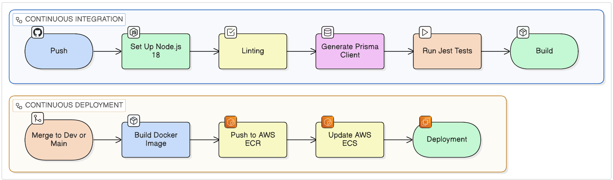

# 2025-SharedGo
</img>

<a href="https://react.dev"></a>
<a href="https://www.typescriptlang.org"></a>
<a href="https://nodejs.org/en"></a>
<a href="https://expressjs.com"></a>
<a href="https://www.postgresql.org"></a>
<a href="https://www.prisma.io"></a>
<a href="https://aws.amazon.com"></a>


## Contents
* [Project Description](#project-Description)
* [Stakeholders](#stakeholders)
* [User Stories](#user-stories)
* [Project structure](#project-structure)
* [Tech Stack](#teckstack)
* [CI/CD diagram](#ci/cd-diagram)
* [Flow Steps](#flow-steps)
* [Team members](#team-members)

## Documentation

- [Kanban Board](https://github.com/orgs/spe-uob/projects/392)
- [Milestones](https://github.com/spe-uob/2025-SharedGo/milestones)
- [Issues](https://github.com/spe-uob/2025-SharedGo/issues)
- [Pull Requests](https://github.com/spe-uob/2025-SharedGo/pulls)
- [Docs Folder](https://github.com/spe-uob/2025-SharedGo/tree/main/Docs)

## Project Description
   Shared-Go aims to provide the most loved real-time activity map, through a Progressive Web App. Shared-Go will enable users to create and join events through a map-based user interface. The project will directly impact use-cases for Event Organisers, Societies, and Groups.

## Stakeholders
* #### Event organizers
   - Description

      They are able to create new activities, oversee attendees, advertise within societies, send invitations and share ongoing updates.

* #### Individual users
    - Description

      The target users of this application are individuals who value social interaction and experience. They need an integrated platform that combines functions for activity discovery, participation, initiation and management. Users can quickly find events based on their geographical location or personalized recommendations, easily complete registration
      and reply, and communicate effectively with event organizers anytime and anywhere, thereby enriching their social life and event experience.
  
* #### Family and Friends Group
   - Description

     These groups focus on collective participation. They value features that help them stay connected during events, and ensure that everyone can easily join in
      
* #### Societies
   - Description

     Societies want to be able to display and advertise their events to the users. They want to easily be able to add their events to the interactive map, ensuring all users gain exposure to their events and can easily sign up.

 * #### The Client
    - Description

      As our point of contact, the client ensures that the projects expands in the intended direction, as per the application's purpose and envisioned end-goal. This includes regular meetings, checking not only progress, but also understanding. This means that the result can be successfully reached, with everyone involved, learning and comprehending along the way.


## User Stories
* As an event host, I want to make it easy to set up, manage and advertise events so that others can join.

* As the client, I want all (direct & indirect) users to have a way of setting-up informal meet-ups. The goal is "to build the most loved real-time activity map". I would like the app to positively impact direct use-cases, for groups, societies, event organisers, and the list goes on!

* As a society, I want to be able to advertise all my events quickly and conveniently. I would like my society and its socials to be displayed to all users via the application and I want users to be able to join my society easily.

## Project structure
> [!NOTE]
> For a more thorough explanation of project structure Detail, see [Docs](https://github.com/spe-uob/2025-SharedGo/tree/dev/Docs).

> For a more thorough explanation of the Backend structure see the [API_README](https://github.com/spe-uob/2025-SharedGo/blob/dev/Backend/API_README.md).

>For a more thorough explanation of AWS, Postgresql setup Detail, see[Setup Guide](https://github.com/spe-uob/2025-SharedGo/blob/180-upload-vertification-detail-step/Docs/database_setup.md)

```text
SharedGO/
├── .github/
│   ├── ISSUE_TEMPLATE/           # Custom issue reporting forms
│   ├── PULL_REQUEST_TEMPLATE/    # PR template
│   └── workflows/                # CI/CD automation files 
├── Backend/                      # Node.js/Express server logic
│   ├── prisma/                   # Database schema and migrations
│   ├── src/
│   │   ├── generated/            # Auto-generated types/files
│   │   ├── middleware/           # Auth and request validation
│   │   ├── routes/               # API endpoints
│   │   ├── socket/               # Real-time communication (Socket.io)
│   │   ├── types/                # express session
│   │   ├── index.ts              # Server entry point
│   │   ├── seed.ts               # Database seeding script
│   │   └── session.ts            # Session management
│   ├── tests/                    # Backend unit tests
│   ├── Dockerfile                # Containerization config
│   ├── API_README.md             # Documentation for API endpoints
│   └── DEVELOPER_README.md       # Setup guide for backend devs
├── Frontend/                     # React/Vite web application
│   ├── public/                   # Static assets
│   ├── src/
│   │   ├── assets/               # Icons
│   │   ├── components/           # Reusable UI components
│   │   ├── pages/                # View/Screen components
│   │   ├── App.tsx               # Main application component
│   │   └── main.tsx              # React entry point
│   ├── vite.config.ts            # Vite build configuration
│   └── README.md                 # Frontend-specific documentation
└── Docs/                         # Project management & design
│   ├── Architecture/             # System diagrams and logic flow
│   ├── database/                 # DB diagrams
│   ├── design/                   # Figma designs
│   ├── Minutes/                  # Client and team meeting notes
│   ├── Presentations/            # Slide materials
│   ├── AI Tools.md               # Log of AI usage in development
│   └── testing_day_survey.pdf    # User testing feedback & results
├── README.md                     # Project documentation
```

## TechStack
<!-- ### MVP Architecture

 -->

### Architecture diagram


## CI/CD diagram


## Chat logic workflow


## Flow Steps
* #### Indivisual user
     1. Register and log in
     2. Grant location access to see nearby events
     3. Browse events by filter (interest and time)
     4. Tap an event pin to see details
     5. Click "join"
     6. Recieve confirmation
     7. Added to the schedule and access group chat
     
        
* #### Host
     1. Log in with verified host account
     2. Click "create event"
     3. Fill in event details (title, time, location, capacity)
     4. Click "publish"
     5. Event appers on the map, chat is created

* #### Friend group & Societies
     1. Click "create private event"
     2. Fills in event details (title, time, location, capacity)
     3. Chooses friends from contacts/app list to invite
     4. Click "create & send invites"
     5. Event is created but only visible to invited users
     6. Invited users receive notification
     7. Accepted users added to group chat
        
## Developer instructions

- first clone the repository
  - ```git clone https://github.com/spe-uob/2025-SharedGo.git``` ( HTTPS )
  - ```git clone git@github.com:spe-uob/2025-SharedGo.git``` ( SSH )
- navigate into the folder
  
  ```cd 2025-SharedGo```
- Install the dependencies for both the frontend and the backend
  - for frontend:
    
    ```cd frontend```
    
    ```npm i```
  - for backend:
    
    ```cd backend```
    
    ```npm ci```
    
    ```cd src```
    
    ```npx prisma generate```

    ```npx prisma migrate main```

- first start the backend

  ```cd Backend```

  ```npm run build```

  ```npm run main```

- then start the frontend

  ```cd Frontend```

  ```npm run main```

## Team Members
| Name | Student id | University Email|  
|  -------------- |-----------------------|-----------|
|  Jingxiang Zhang  | 2606056 | ub24928@bristol.ac.uk |
|  Soko Sengesamba  | 2509140 | az23290@bristol.ac.uk |
|  Minzhe Hu        | 2594564 | qp24108@bristol.ac.uk |
| Thibault Crosnier | 2519193 | pv24925@bristol.ac.uk |
|  Oliver Clease    | 2588166 | ph24475@bristol.ac.uk |
